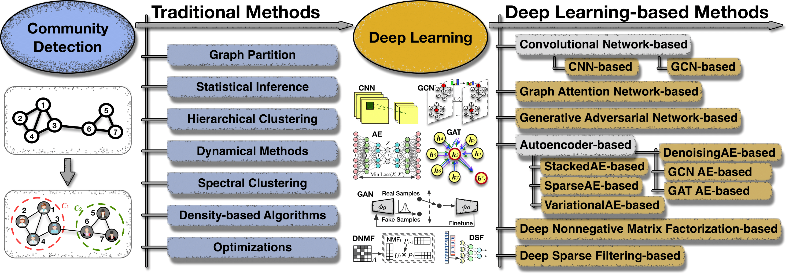
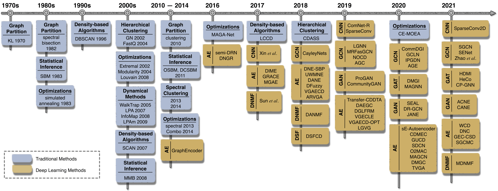

# Awesome Deep Community Detection
    

A collection of papers, implementations, datasets, and tools for deep and non-deep community detection.

- [Awesome Deep Community Detection](#awesome-Deep-Community-Detection)
  - [Survey](#survey)
  - [Convolutional Networks-based Community Detection](#convolutional-networks-based-community-detection)
  	- [CNN-based Community Detection](#cnn-based-community-detection)
  	- [GCN-based Community Detection](#gcn-based-community-detection)
  - [Graph Attention Network-based Community Detection](#graph-attention-network-based-community-detection)
  - [Graph Adversarial Network-based Community Detection](#graph-adversarial-network-based-community-detection)
  - [Autoencoder-based Community Detection](#autoencoder-based-community-detection)
  - [Other Deep Learning-based Community Detection](#other-deep-learning-based-community-detection)
  - [Non-Deep Learning-based Communtiy Detection](#non-deep-learning-based-communtiy-detection)
  - [Datasets](#datasets)
  - [Tools](#tools)  

----------
## Traditional Methods _VS._ Deep Learninig-based Methods

----------
## A Timeline of Community Detection Development

----------
## Survey
| Paper Title | Venue | Year | Materials | 
| ---- | :----: | :----: | :----: | 
| A comprehensive survey on community detection with deep learning | IEEE TNNLS | 2022 | [[Paper](https://ieeexplore.ieee.org/document/9732192)]   [[Report](https://www.aminer.cn/research_report/60da8c5f30e4d5752f50e7af)]   [[Supplementary](https://www.researchgate.net/publication/359222598_Supplementary_DeepCommunityDetectionSurveypdf)]|
| A survey of community detection approaches: From statistical modeling to deep learning | IEEE TKDE | 2021 | [[Paper](https://ieeexplore.ieee.org/abstract/document/9511798)]|
| Deep learning for community detection: Progress, challenges and opportunities | IJCAI | 2020 | [[Paper](https://www.ijcai.org/Proceedings/2020/0693.pdf)]  [[Report](https://cloud.tencent.com/developer/article/1632305)]| 
| A survey of community detection methods in multilayer networks | Data Min. Knowl. Discov. | 2020 | [[Paper](https://link.springer.com/article/10.1007/s10618-020-00716-6)] |
| Community detection in node-attributed social networks: A survey | Comput. Sci. Rev. | 2020 | [[Paper](https://www.sciencedirect.com/science/article/pii/S1574013720303865)] |
| Community detection in networks: A multidisciplinary review | J. Netw. Comput. Appl. | 2018| [[Paper](https://www.sciencedirect.com/science/article/pii/S1084804518300560)] |
| Community discovery in dynamic networks: A survey | ACM Comput. Surv. | 2018 | [[Paper](https://dl.acm.org/doi/10.1145/3172867)] |
| Evolutionary computation for community detection in networks: A review | IEEE TEVC | 2018 | [[Paper](https://ieeexplore.ieee.org/document/8004509)] |
| Metrics for community analysis: A survey | ACM Comput. Surv. | 2017 | [[Paper](https://dl.acm.org/doi/10.1145/3091106)] |
| Network community detection: A review and visual survey | Preprint | 2017 | [[Paper](https://arxiv.org/abs/1708.00977)] |
| Community detection in networks: A user guide | Phys. Rep. | 2016 | [[Paper](https://www.sciencedirect.com/science/article/abs/pii/S0370157316302964)] |
| Community detection in social networks | WIREs Data Min. Knowl. Discov. | 2016 | [[Paper](https://onlinelibrary.wiley.com/doi/abs/10.1002/widm.1178)]|
| Overlapping community detection in networks: The state-of-the-art and comparative study| ACM Comput. Surv. | 2013 | [[Paper](https://dl.acm.org/doi/10.1145/2501654.2501657)] |
| Clustering and community detection in directed networks: A survey | Phys. Rep. | 2013 | [[Paper](https://www.sciencedirect.com/science/article/abs/pii/S0370157313002822)] |
| Community detection in graphs | Phys. Rep. | 2010 | [[Paper](https://www.sciencedirect.com/science/article/abs/pii/S0370157309002841)] |

----------
## Convolutional Networks-based Community Detection
### CNN-based Community Detection
| Paper Title | Venue | Year | Method | Materials | 
| ---- | :----: | :----: | :----: | :----: | 
|A deep learning approach for semi-supervised community detection in online social networks | Knowl.-Based Syst. | 2021 | SparseConv2D | [[Paper](https://www.sciencedirect.com/science/article/abs/pii/S0950705121006079)] |
|Edge classification based on convolutional neural networks for community detection in complex network | Physica A | 2020 | ComNet-R | [[Paper](https://www.sciencedirect.com/science/article/abs/pii/S0378437120304271)] |
|A deep learning based community detection approach | SAC | 2019 | SparseConv | [[Paper](https://doi.org/10.1145/3297280.3297574)] |
|Deep community detection in topologically incomplete networks | Physica A | 2017 | Xin _et al._ | [[Paper](https://www.sciencedirect.com/science/article/abs/pii/S0378437116308342)] |

### GCN-based Community Detection 
| Paper Title | Venue | Year | Method | Materials | 
| ---- | :----: | :----: | :----: | :----: | 
|Efficient graph convolution for joint node representation learning and clustering  | WSDM | 2022 | GCC | [[Paper](https://dl.acm.org/doi/10.1145/3488560.3498533)] [[Code](https://github.com/chakib401/graph_convolutional_clustering)] |
|Geometric graph representation learning via maximizing rate reduction | WWW | 2022 | $G^2R$ | [[Paper](https://dl.acm.org/doi/pdf/10.1145/3485447.3512170)] [[Code](https://github.com/ahxt/G2R)] | 
| RepBin: Constraint-based graph representation learning for metagenomic binning | AAAI | 2022 | RepBin | [[Paper](https://www.aaai.org/AAAI22Papers/AAAI-4979.XueH.pdf)] [[Code](https://github.com/xuehansheng/RepBin)] |
|SSSNET: Semi-supervised signed network clustering | SDM | 2022 | SSSNET | [[Paper](https://arxiv.org/pdf/2110.06623.pdf)] [[Code](https://github.com/SherylHYX/SSSNET_Signed_Clustering)] | 
|Learning Guarantees for Graph Convolutional Networks on The Stochastic Block Model | ICLR | 2022 | GCN-SBM | [[Paper](https://openreview.net/forum?id=dpXL6lz4mOQ)] |
|When convolutional network meets temporal heterogeneous graphs: An effective community detection method | IEEE TKDE| 2021 | THGCN | [[Paper](https://ieeexplore.ieee.org/document/9479741)] |
|Multi-view contrastive graph clustering | NIPS | 2021 | MCGC | [[paper](https://proceedings.neurips.cc/paper/2021/file/10c66082c124f8afe3df4886f5e516e0-Paper.pdf)] [[Code](https://github.com/Panern/MCGC)] |
|Graph debiased contrastive learning with joint representation clustering | IJCAI | 2021 | Zhao _et al._ | [[Paper](https://www.ijcai.org/proceedings/2021/0473.pdf)] | 
|Spectral embedding network for attributed graph clustering | Neural Netw. | 2021 | SENet | [[Paper](https://www.sciencedirect.com/science/article/pii/S0893608021002227)] | 
|Unsupervised learning for community detection in attributed networks based on graph convolutional network | Neurocomputing | 2021 | SGCN | [[Paper](https://www.sciencedirect.com/science/article/abs/pii/S0925231221008110)] |
|Adaptive graph encoder for attributed graph embedding | KDD | 2020 | AGE | [[Paper](https://dl.acm.org/doi/10.1145/3394486.3403140)][[Code](https://github.com/thunlp/AGE)] |
|CommDGI: Community detection oriented deep graph infomax | CIKM | 2020 | CommDGI | [[Paper](https://dl.acm.org/doi/abs/10.1145/3340531.3412042)] | 
|Going deep: Graph convolutional ladder-shape networks | AAAI | 2020 | GCLN | [[Paper](https://ojs.aaai.org/index.php/AAAI/article/view/5673/5529)] |
|Independence promoted graph disentangled networks | AAAI | 2020 | IPGDN | [[Paper](https://ojs.aaai.org/index.php/AAAI/article/view/5929/5785)] |
|Supervised community detection with line graph neural networks | ICLR | 2019 | LGNN | [[Paper](https://openreview.net/pdf?id=H1g0Z3A9Fm)][[Code](https://github.com/zhengdao-chen/GNN4CD)] |
|Graph convolutional networks meet Markov random fields: Semi-supervised community detection in attribute networks | AAAI | 2019 | MRFasGCN | [[Paper](https://www.aaai.org/ojs/index.php/AAAI/article/view/3780/3658)] |
|Overlapping community detection with graph neural networks | DLG Workshop, KDD | 2019 | NOCD | [[Paper](https://deep-learning-graphs.bitbucket.io/dlg-kdd19/accepted_papers/DLG_2019_paper_3.pdf)][[Code](https://github.com/shchur/overlapping-community-detection)] |
|Attributed graph clustering via adaptive graph convolution | IJCAI | 2019 | AGC | [[Paper](https://www.ijcai.org/Proceedings/2019/0601.pdf)][[Code](https://github.com/karenlatong/AGC-master)] |
|CayleyNets: Graph convolutional neural networks with complex rational spectral filters | IEEE TSP | 2019 | CayleyNets | [[Paper](https://ieeexplore.ieee.org/document/8521593)][[Code](https://github.com/amoliu/CayleyNet)] |

----------
## Graph Attention Network-based Community Detection
| Paper Title | Venue | Year | Method | Materials | 
| ---- | :----: | :----: | :----: | :----: | 
|Detecting communities from heterogeneous graphs: A context path-based graph neural network model | CIKM | 2021 | <nobr> CP-GNN <nobr> | [[Paper](https://arxiv.org/pdf/2109.02058.pdf)][[Code](https://github.com/RManLuo/CP-GNN)] | 
|HDMI: High-order deep multiplex infomax | WWW | 2021 | HDMI | [[Paper](https://dl.acm.org/doi/fullHtml/10.1145/3442381.3449971)][[Code](https://github.com/baoyujing/HDMI)] |
|Self-supervised heterogeneous graph neural network with co-contrastive learning | KDD | 2021 | HeCo | [[Paper](https://dl.acm.org/doi/10.1145/3447548.3467415)][[Code](https://github.com/liun-online/HeCo)] |
|Unsupervised attributed multiplex network embedding | AAAI | 2020 | DMGI | [[Paper](https://ojs.aaai.org/index.php/AAAI/article/view/5985)][[Code](https://github.com/pcy1302/DMGI)] |
|MAGNN: Metapath aggregated graph neural network for heterogeneous graph embedding | WWW | 2020 | MAGNN | [[Paper](https://dl.acm.org/doi/abs/10.1145/3366423.3380297)] [[Code](https://github.com/cynricfu/MAGNN)] |

----------
## Graph Adversarial Network-based Community Detection
| Paper Title | Venue | Year | Method | Materials | 
| ---- | :----: | :----: | :----: | :----: |  
|CANE: Community-aware network embedding via adversarial training |Knowl. Inf. Syst. | 2021 | CANE | [[Paper](https://link.springer.com/article/10.1007%2Fs10115-020-01521-9)] | 
|Self-training enhanced: Network embedding and overlapping community detection with adversarial learning | IEEE TNNLS | 2021 | ACNE   ACNE-ST   | [[Paper](https://ieeexplore.ieee.org/document/9451542)] |
|Adversarial Learning of Balanced Triangles for Accurate Community Detection on Signed Networks |ICDM | 2021 | ABC | [[Paper](https://ieeexplore.ieee.org/document/9679159)] | 
|SEAL: Learning heuristics for community detection with generative adversarial networks | KDD | 2020 | SEAL | [[Paper](https://dl.acm.org/doi/abs/10.1145/3394486.3403154)][[Code](https://github.com/yzhang1918/kdd2020seal)] |
|Multi-class imbalanced graph convolutional network learning | IJCAI | 2020 | DR-GCN | [[Paper](https://www.ijcai.org/proceedings/2020/0398.pdf)] |
|JANE: Jointly adversarial network embedding | IJCAI | 2020| JANE | [[Paper](https://www.ijcai.org/Proceedings/2020/0192.pdf)] |
|ProGAN: Network embedding via proximity generative adversarial network | KDD | 2019 | ProGAN | [[Paper](https://dl.acm.org/doi/pdf/10.1145/3292500.3330866)] |
|CommunityGAN: Community detection with generative adversarial nets | WWW | 2019 | CommunityGAN | [[Paper](https://dl.acm.org/doi/abs/10.1145/3308558.3313564)][[Code](https://github.com/SamJia/CommunityGAN)] |

----------
## Autoencoder-based Community Detection
| Paper Title | Venue | Year | Method | Materials | 
| ---- | :----: | :----: | :----: | :----: | 
|Exploring temporal community structure via network embedding | IEEE TCYB | 2022 | VGRGMM | [[Paper](https://ieeexplore.ieee.org/abstract/document/9768181)]|
|Deep neighbor-aware embedding for node clustering in attributed graphs | Pattern Recognit. | 2022 | DNENC | [[Paper](https://doi.org/10.1016/j.patcog.2021.108230)] |
|A weighted network community detection algorithm based on deep learning | Appl. Math. Comput. | 2021 | WCD | [[Paper](https://www.sciencedirect.com/science/article/pii/S0096300321000606)] |
| DNC: A deep neural network-based clustering-oriented network embedding algorithm | J. Netw. Comput. Appl. | 2021 | DNC | [[Paper](https://www.sciencedirect.com/science/article/pii/S1084804520303209)] |
|Boosting nonnegative matrix factorization based community detection with graph attention auto-encoder | IEEE TBD | 2021 | NMFGAAE | [[Paper](https://ieeexplore.ieee.org/abstract/document/9512416)]|
|Self-supervised graph convolutional network for multi-view clustering | IEEE TMM | 2021 | SGCMC | [[Paper](https://ieeexplore.ieee.org/document/9472979)] |
|Graph embedding clustering: Graph attention auto-encoder with cluster-specificity distribution | Neural Netw. | 2021 | GEC-CSD | [[Paper](https://www.sciencedirect.com/science/article/pii/S0893608021002008)][[Code](https://github.com/xdweixia/SGCMC)] |
|An evolutionary autoencoder for dynamic community detection | Sci. China Inf. Sci. | 2020 | <nobr> sE-Autoencoder <nobr> | [[Paper](https://link.springer.com/article/10.1007/s11432-020-2827-9)] |
|Stacked autoencoder-based community detection method via an ensemble clustering framework | Inf. Sci. | 2020 | CDMEC | [[Paper](https://www.sciencedirect.com/science/article/abs/pii/S002002552030270X)] |
|Community-centric graph convolutional network for unsupervised community detection | IJCAI | 2020 | GUCD | [[Paper](https://www.ijcai.org/Proceedings/2020/0486.pdf)] |
|Structural deep clustering network |  WWW | 2020 | SDCN | [[Paper](https://dl.acm.org/doi/10.1145/3366423.3380214)][[Code](https://github.com/bdy9527/SDCN)] |
|One2Multi graph autoencoder for multi-view graph clustering | WWW | 2020 | One2Multi | [[Paper](https://dl.acm.org/doi/10.1145/3366423.3380079)][[Code](https://github.com/googlebaba/WWW2020-O2MAC)] |
|Multi-view attribute graph convolution networks for clustering | IJCAI | 2020 | MAGCN | [[Paper](https://www.ijcai.org/Proceedings/2020/0411.pdf)] |
|Deep multi-graph clustering via attentive cross-graph association | WSDM | 2020 | DMGC | [[Paper](https://dl.acm.org/doi/abs/10.1145/3336191.3371806)][[Code](https://github.com/flyingdoog/DMGC)] |
|Effective decoding in graph auto-encoder using triadic closure | AAAI | 2020 | TGA   TVGA   | [[Paper](https://ojs.aaai.org/index.php/AAAI/article/view/5437/5293)] |
|Graph representation learning via ladder gamma variational autoencoders | AAAI | 2020 | LGVG | [[Paper](https://ojs.aaai.org/index.php/AAAI/article/view/6013/5869)] |
|High-performance community detection in social networks using a deep transitive autoencoder | Inf. Sci. | 2019 | <nobr> Transfer-CDDTA <nobr> | [[Paper](https://www.sciencedirect.com/science/article/abs/pii/S0020025519303251)] |
|Attributed graph clustering: A deep attentional embedding approach | IJCAI | 2019 | DAEGC | [[Paper](https://www.ijcai.org/Proceedings/2019/0509.pdf)] |
|Stochastic blockmodels meet graph neural networks | ICML | 2019 | DGLFRM | [[Paper](http://proceedings.mlr.press/v97/mehta19a/mehta19a.pdf)][[Code](https://github.com/nikhil-dce/SBM-meet-GNN)] |
|Variational graph embedding and clustering with laplacian eigenmaps | IJCAI | 2019 | VGECLE | [[Paper](https://www.ijcai.org/Proceedings/2019/0297.pdf)] |
|Optimizing variational graph autoencoder for community detection | BigData | 2019 | VGAECD-OPT | [[Paper](https://ieeexplore.ieee.org/abstract/document/9006123)] |
|Integrative network embedding via deep joint reconstruction | IJCAI | 2018 | UWMNE | [[Paper](https://www.ijcai.org/Proceedings/2018/0473.pdf)] |
|Deep attributed network embedding | IJCAI | 2018 | DANE | [[Paper](https://www.ijcai.org/Proceedings/2018/0467.pdf)][[Code](https://github.com/gaoghc/DANE)] |
|Deep network embedding for graph representation learning in signed networks | IEEE TCYB | 2018 | DNE-SBP | [[Paper](https://ieeexplore.ieee.org/document/8486671)][[Code](https://github.com/shenxiaocam/Deep-network-embedding-for-graph-representation-learning-in-signed-networks)] |
|DFuzzy: A deep learning-based fuzzy clustering model for large graphs | Knowl. Inf.  Syst. | 2018 | DFuzzy | [[Paper](https://link.springer.com/article/10.1007/s10115-018-1156-3)] |
|Learning community structure with variational autoencoder | ICDM | 2018 | VGAECD | [[Paper](https://ieeexplore.ieee.org/document/8594831)] |
|Adversarially regularized graph autoencoder for graph embedding | IJCAI | 2018 | ARGA   ARVGA   | [[Paper](https://www.ijcai.org/Proceedings/2018/0362.pdf)][[Code](https://github.com/Ruiqi-Hu/ARGA)]| 
| BL-MNE: Emerging heterogeneous social network embedding through broad learning with aligned autoencoder | ICDM | 2017 | DIME | [[Paper](https://doi.org/10.1109/ICDM.2017.70)][[Code](http://www.ifmlab.org/files/code/Aligned-Autoencoder.zip)] |
|MGAE: Marginalized graph autoencoder for graph clustering | CIKM | 2017 | MGAE | [[Paper](https://dl.acm.org/doi/10.1145/3132847.3132967)][[Code](https://github.com/FakeTibbers/MGAE)] |
|Graph clustering with dynamic embedding | Preprint | 2017 | GRACE | [[Paper](https://arxiv.org/abs/1712.08249)] | 
|Modularity based community detection with deep learning | IJCAI | 2016 | semi-DRN | [[Paper](https://www.ijcai.org/Proceedings/16/Papers/321.pdf)][[Code](http://yangliang.github.io/code/DC.zip)] |
|Deep neural networks for learning graph representations | AAAI | 2016 | DNGR | [[Paper](https://dl.acm.org/doi/10.5555/3015812.3015982)] |
|Learning deep representations for graph clustering | AAAI | 2014 | GraphEncoder | [[Paper](https://www.aaai.org/ocs/index.php/AAAI/AAAI14/paper/view/8527/8571)][[Code](https://github.com/quinngroup/deep-representations-clustering)] |

----------
## Other Deep Learning-based Community Detection 
| Paper Title | Venue | Year | Method | Materials | 
| ---- | :----: | :----: | :----: | :----: | 
|CGC: Contrastive Graph Clustering for Community Detection and Tracking | WWW | 2022 | CGC | [[Paper](https://dl.acm.org/doi/10.1145/3485447.3512160)] |
|Deep graph clustering via dual correlation reduction | AAAI | 2022 | DCRN | [[Paper](https://www.aaai.org/AAAI22Papers/AAAI-5928.LiuY.pdf)] [[Code](https://github.com/yueliu1999/DCRN)]|
|Fine-grained attributed graph clustering | SDM | 2022 | FGC | [[Paper](https://epubs.siam.org/doi/epdf/10.1137/1.9781611977172.42)] [[Code](https://github.com/sckangz/FGC)] |
|Graph filter-based multi-view attributed graph clustering | IJCAI | 2021 | MvAGC | [[Paper](https://www.ijcai.org/proceedings/2021/0375.pdf)] [[Code](https://github.com/sckangz/MvAGC)] |
|Community detection based on modularized deep nonnegative matrix factorization | Int. J. Pattern Recognit. Artif. Intell. | 2020 | MDNMF | [[Paper](https://www.worldscientific.com/doi/abs/10.1142/S0218001421590060)] |
|Deep autoencoder-like nonnegative matrix factorization for community detection | CIKM | 2018 | DANMF | [[Paper](https://dl.acm.org/doi/10.1145/3269206.3271697)][[Code](https://github.com/benedekrozemberczki/DANMF)] |
|Community discovery in networks with deep sparse filtering | Pattern Recognit. | 2018 | DSFCD | [[Paper](https://www.sciencedirect.com/science/article/abs/pii/S003132031830116X)] |
|A non-negative symmetric encoder-decoder approach for community detection | CIKM | 2017 | Sun _et al._ | [[Paper](https://dl.acm.org/doi/abs/10.1145/3132847.3132902)] |

----------
## Non-Deep Learning-based Communtiy Detection
| Paper Title | Venue | Year | Method | Materials |
| ---- | :----: | :----: | :----: | :----: |
|Differentially private community detection for stochastic block models | ICML | 2022 | Seif _et al._ | [[Paper](http://128.84.4.18/abs/2202.00636)] |
|Community detection in multiplex networks based on evolutionary multi-task optimization and evolutionary clustering ensemble | IEEE TEVC | 2022 | BSMCD | [[Paper](https://ieeexplore.ieee.org/document/9802693)] |
|HB-DSBM: Modeling the dynamic complex networks from community level to node level | IEEE TNNLS | 2022 | HB-DSBM | [[Paper](https://ieeexplore.ieee.org/document/9721420)]|
|Information diffusion-aware likelihood maximization optimization for community detection | Inf. Sci. | 2022 | EM-CD   L-Louvain   | [[Paper](https://www.sciencedirect.com/science/article/pii/S0020025522003334)] |
|Community detection in partially observable social networks | ACM TKDD | 2022 | KroMFac | [[Paper](https://dl.acm.org/doi/abs/10.1145/3461339)] |
|Community detection in graph: An embedding method | IEEE TNSE | 2022 | SENMF | [[Paper](https://ieeexplore.ieee.org/abstract/document/9626627)] | 
|Community detection using local group assimilation | Expert Syst. Appl. | 2022| LGA | [[Paper](https://www.sciencedirect.com/science/article/pii/S0957417422010600)] |
|Residual2Vec: Debiasing graph embedding with random graphs | NIPS | 2021 | residual2vec | [[Paper](https://proceedings.neurips.cc/paper/2021/file/ca9541826e97c4530b07dda2eba0e013-Paper.pdf)] [[Code](https://github.com/skojaku/residual2vec)] |
|Streaming belief propagation for community detection | NIPS | 2021 | StSBM | [[Paper](https://proceedings.neurips.cc/paper/2021/file/e2a2dcc36a08a345332c751b2f2e476c-Paper.pdf)] |
|Triangle-aware spectral sparsifiers and community detection | KDD | 2021 | Sotiropoulos _et al._ | [[Paper](https://dl.acm.org/doi/10.1145/3447548.3467260)] [[Code](https://www.dropbox.com/s/0p0ybkpx19jt3ii/codeKDDTriangleAware.zip?dl=0)] |
|Self-guided community detection on networks with missing edges | IJCAI | 2021 | SGCD | [[Paper](https://www.ijcai.org/proceedings/2021/0483.pdf)] |
|Proximity-based group formation game model for community detection in social network | Knowl.-Based Syst. | 2021 | PBCD | [[Paper](https://linkinghub.elsevier.com/retrieve/pii/S0950705120307991)] |
|When random initializations help: A study of variational inference for community detection | J. Mach. Learn. Res. | 2021 | BCAVI | [[Paper](https://www.jmlr.org/papers/volume22/19-630/19-630.pdf)] |
|Identification of communities with multi-semantics via bayesian generative model | IEEE TBD | 2021 | ICMS | [[Paper](https://ieeexplore.ieee.org/document/9632396)] |
|A network embedding-enhanced Bayesian model for generalized community detection in complex networks | Inf. Sci. | 2021 | NEGCD | [[Paper](https://doi.org/10.1016/j.ins.2021.06.020)] |
|Multi-objective evolutionary clustering for large-scale dynamic community detection | Inf. Sci. | 2021 | <nobr> DYN-MODPSO <nobr> | [[Paper](https://www.sciencedirect.com/science/article/pii/S0020025520311117)] |
|A joint community detection model: Integrating directed and undirected probabilistic graphical models via factor graph with attention mechanism | IEEE TBD | 2021 | AdaMRF | [[Paper](https://ieeexplore.ieee.org/document/9511816)] |
|Evolutionary markov dynamics for network community detection | IEEE TKDE | 2020 | ePMCL | [[Paper](https://ieeexplore.ieee.org/document/9099469)] |
|A network reduction-based multiobjective evolutionary algorithm for community detection in large-scale complex networks | IEEE TCYB | 2020 | RMOEA | [[Paper](https://ieeexplore.ieee.org/document/8486719)] |
|Integrating group homophily and individual personality of topics can better model network communities | ICDM | 2020 | GHIPT | [[Paper](https://ieeexplore.ieee.org/document/9338379)] |
|Detecting the evolving community structure in dynamic social networks | World Wide Web J. | 2020 | DECS | [[Paper](https://link.springer.com/article/10.1007/s11280-019-00710-z)] [[Code](https://github.com/FanzhenLiu/DECS)] |
|EdMot: An edge enhancement approach for motif-aware community detection | KDD | 2019 | EdMot | [[Paper](https://dl.acm.org/doi/10.1145/3292500.3330882)] |
|LPANNI: Overlapping community detection using label propagation in large-scale complex networks | IEEE TKDE | 2019 | LPANNI | [[Paper](https://ieeexplore.ieee.org/document/8443129)] |
|Detecting prosumer-community groups in smart grids from the multiagent perspective | IEEE TSMC | 2019 | PVMAS | [[Paper](https://ieeexplore.ieee.org/document/8660684)] |
|Local community mining on distributed and dynamic networks from a multiagent perspective | IEEE TCYB | 2016 | AOCCM | [[Paper](https://ieeexplore.ieee.org/document/7124425)] |
|General optimization technique for high-quality community detection in complex networks | Phys. Rev. E | 2014 | Combo | [[Paper](https://journals.aps.org/pre/abstract/10.1103/PhysRevE.90.012811)] |
|Spectral methods for community detection and graph partitioning | Phys. Rev. E | 2013 | -- | [[Paper](https://journals.aps.org/pre/abstract/10.1103/PhysRevE.88.042822)] |
|Stochastic blockmodels and community structure in networks | Phys. Rev. E | 2011 | DCSBM | [[Paper](https://journals.aps.org/pre/abstract/10.1103/PhysRevE.83.016107)] |

----------
## Datasets
### Citation/Co-authorship Networks
- Citeseer, Cora, Pubmed https://linqs.soe.ucsc.edu/data
- DBLP http://snap.stanford.edu/data/com-DBLP.html
- Chemistry, Computer Science, Medicine, Engineering http://kddcup2016.azurewebsites.net/
### Online Social Networks
- Facebook http://snap.stanford.edu/data/ego-Facebook.html
- Epinions http://www.epinions.com/
- Youtube http://snap.stanford.edu/data/com-Youtube.html
- Last.fm https://www.last.fm/
- LiveJournal http://snap.stanford.edu/data/soc-LiveJournal1.html
- Gplus http://snap.stanford.edu/data/ego-Gplus.html
### Traditional Social Networks
- Cellphone Calls http://www.cs.umd.edu/hcil/VASTchallenge08/
- Enron Mail http://www.cs.cmu.edu/~enron/
- Friendship https://dl.acm.org/doi/10.1145/2501654.2501657
- Rados http://networkrepository.com/ia-radoslaw-email.php 
- Karate, Football, Dolphin http://www-personal.umich.edu/~mejn/netdata/
### Webpage Networks
- IMDb https://www.imdb.com/
- Wiki https://linqs.soe.ucsc.edu/data
### Product Co-purchasing Networks
- Amazon http://snap.stanford.edu/data/#amazon
### Other Networks
- Internet http://www-personal.umich.edu/~mejn/netdata/
- Java https://github.com/gephi/gephi/wiki/Datasets
- Hypertext http://www.sociopatterns.org/datasets
 
 ----------
## Tools
- Gephi https://gephi.org/
- Pajek http://mrvar.fdv.uni-lj.si/pajek/
- LFR https://www.santofortunato.net/resources

----------
**Disclaimer**

If you have any questions, please feel free to contact us.
Emails: <u>fanzhen.liu@hdr.mq.edu.au</u>, <u>xing.su2@hdr.mq.edu.au</u>
